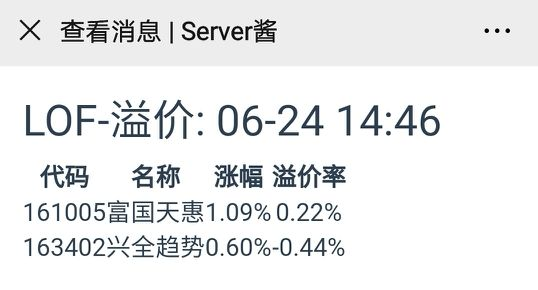
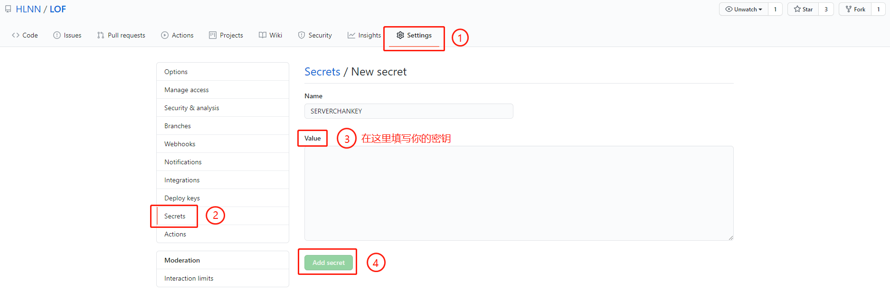

# LOF

LOF每日溢价监控助手，用于每日定时检查LOF溢价情况，并自动将数据推送到微信。

> 所有数据均爬取自[集思录](https://www.jisilu.cn/data/lof/#stock)

## 使用 GitHub Actions

**推荐使用`GitHub Actions`的方式运行此程序**。`GitHub Actions`可以免费使用，不需要使用自己服务器。

**注意**：不要直接在代码中修改`ServerChanKey`等敏感信息，公开仓库中的内容是任何人都可以查看的。**请使用secret功能储存敏感信息**。

配置步骤：
 - 点击右上角的`Star`
 - 点击右上角的`Fork`克隆这个仓库
 - `Fork`的仓库默认禁用了`workflows`功能，需要手动打开：
   - 点击上方的`Actions`选项卡
   - 点击`I understand my workflows, go ahead and run them`
 - 在仓库的`Settings`中设置[Server酱](http://sc.ftqq.com/3.version)的秘钥：
   - 进入[Server酱](http://sc.ftqq.com/3.version)网站，使用GitHub登入，并绑定微信。
   - 获得秘钥`SCKEY`
   - 将秘钥以`ServerChanKey: SCKEY`的格式存入`【Settings】->【Secrets】`

 - 任意修改[`README.md`](./README.md)中的内容或修改配置文件[`config.cfg`](./config.cfg)触发`Actions`，检查程序是否能正常运行

## 自定义修改

可在[`config.cfg`](./config.cfg)及[`lof.yml`](./.github/workflows/lof.yml)中修改配置内容：

 - 监控LOF列表：修改[`config.cfg`](./config.cfg)中的`LOFList`

 - 推送时间：修改[`lof.yml`](./.github/workflows/lof.yml)中的`schedule`

 - 仅周内推送：修改[`lof.yml`](./.github/workflows/lof.yml)中的`schedule`

 - 设置溢价/折价推送阈值：修改[`config.cfg`](./config.cfg)中的溢价阈值`disLimit`和折价阈值`preLimit`，单位为`%`

## Changelog

 - 2020-07-08，添加配置文件
 - 2020-07-06，添加溢价折价推送阈值
 - 2020-07-06，添加仅周内运行选项  

都看到这了，点个`Star`呗